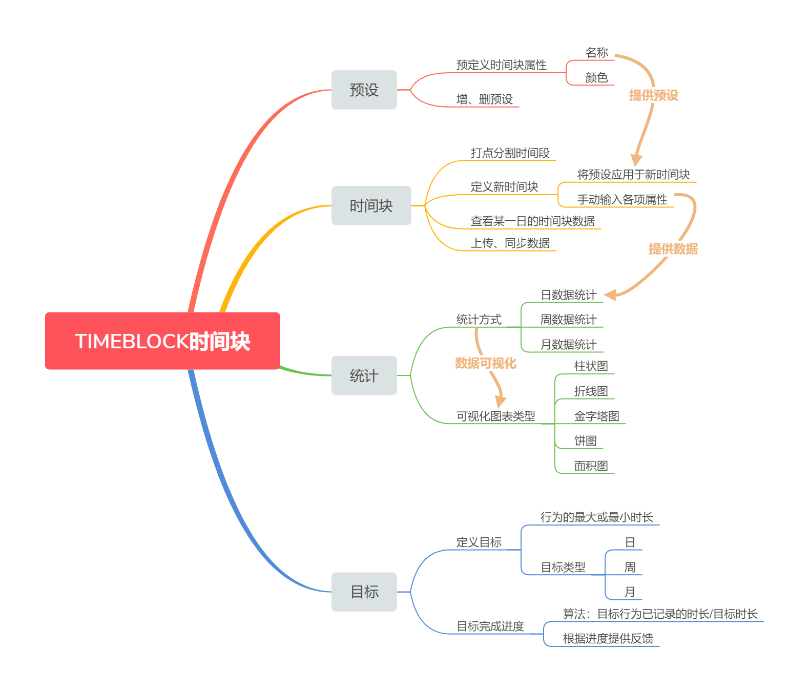
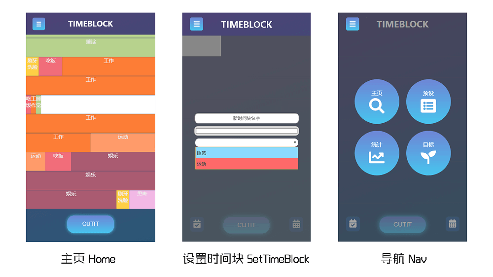
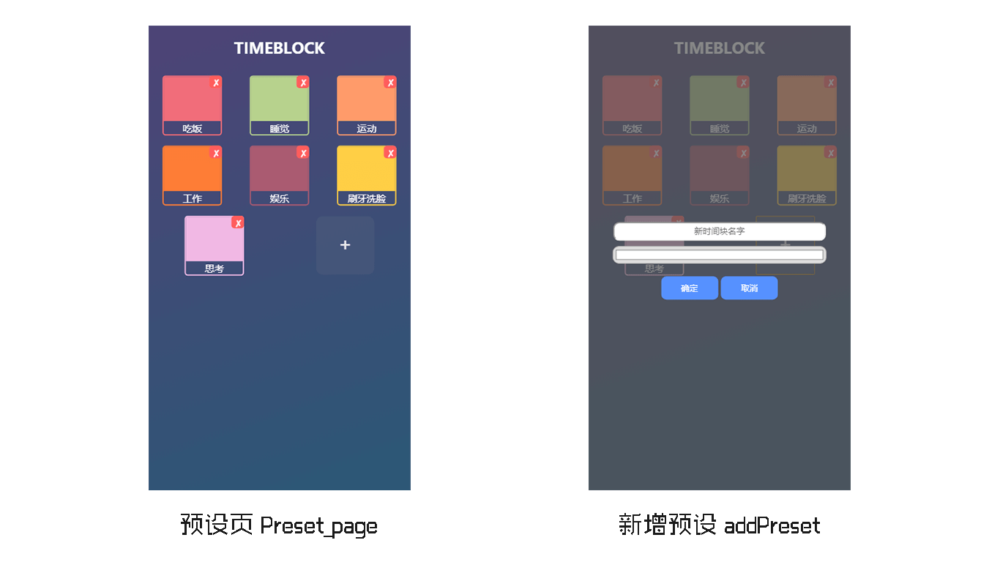
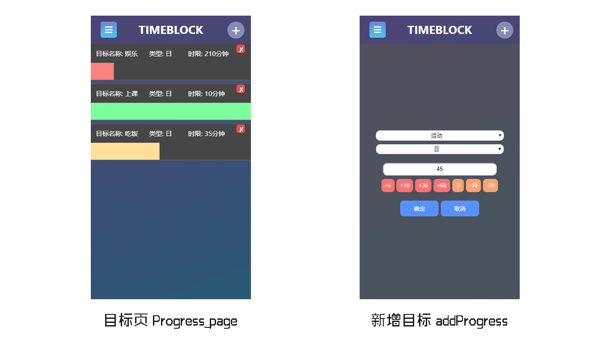
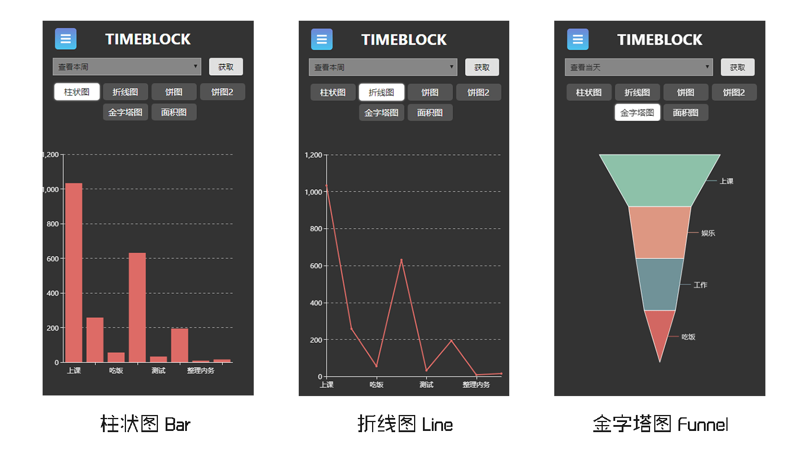
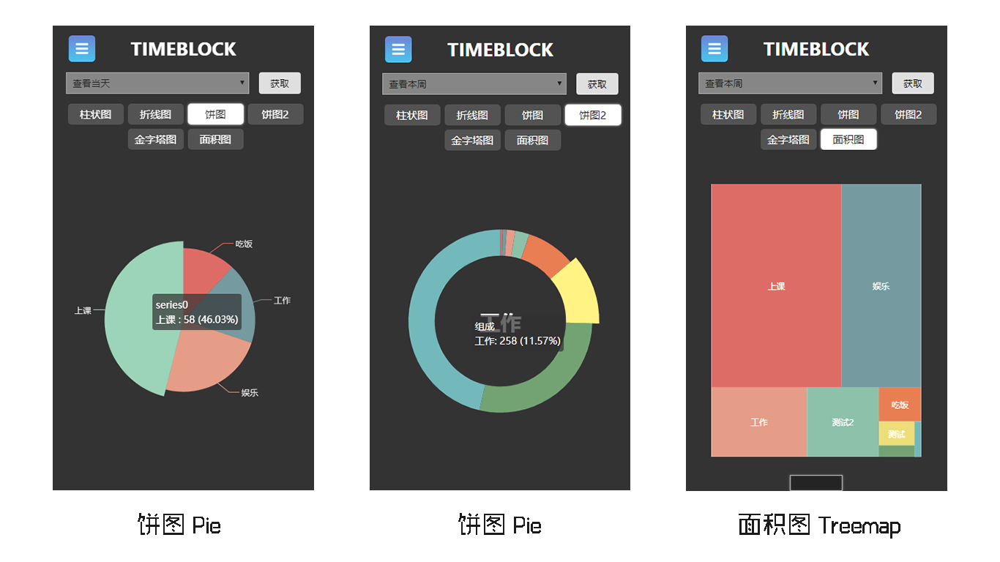

## 时间块 TIMEBLOCK
> Design & Develop：JUNGA ( xujunjia98@163.com )

<div align=center>


</div>

> LOGO元素：时钟，矩形，产品名。 寓意着时间的使用是碎片化的，本产品的功能就是将这碎片化的数据加以管理和利用。

## 背景

 在我们自身的行为习惯里，有哪些习惯是潜在性错误而未被发现的。时间是有限的，在一天当中，我们的哪些行为习惯是消耗大量时间而不会获得任何效益的，哪些行为习惯是好的，但所执行的时间却十分短，对于每一种行为，它在一天、一星期、一个月中占用的时间是多长？如果它是一个错误的行为习惯，我们需要能够发现它，才能做出措施去纠正它。  
 总之，如果对自身有比较高的要求，就需要收集自身的数据来更好地改善自己的行为习惯。为此，开发时间块系统（TIMEBLOCK），将一天中的时间使用块级化，让每个行为习惯都得以记录下来，再经过后台的统计分析完成后反馈给用户，以便于用户了解自己，审视自身的不足，在掌握自身时间使用的同时，改进自身的行为习惯以在未来获得更好的生活体验。 

## 定义

- 时间块：用户在打点时，与上一次打点的时间之间形成的一个块级元素，用来分割时间段。该时间块拥有持续时长、名称、色彩三项属性，其内部包含的数据可被用于统计分析。
- 预设块：用户可以预先定义描述时间块的样式，在新生成时间块的时候直接将预定义的颜色和名字属性赋予新时间块

## 设计&开发目标
- 让用户可以通过打点分割时间段并命名的方式记录一天中时间的使用情况；
- 将用户记录的行为数据进行统计再以可视化数据的形式返回给用户，让用户直观感受时间的使用情况；
- 用户可以对色块进行预设，在新增时间块时可以直接使用预设。
- 用户可以对某个行为设置时长目标，在一天、一星期、一周的时长进行限制，当某个行为统计的时长超出限制时会给予反馈。

## 产品简介
该软件提供了量化记录时间的功能，并能够根据所记录的时间将数据可视化地展现给用户。

在本软件内，一天的时间被分为12个时间槽，每个时间槽代表2个小时。用户可将一天中的时间以打点分割的方式，虚拟地分割自己的时间，并给予时间块命名和颜色。

时间块的数据会以天为单位被记录，可在主页选择查看当天或某一天的时间块分布情况。

时间块的属性包含该行为的时长和名字两项重要属性，打点后形成的时间块会以实际的比例填占当前时间的时间槽。时间块不可删除。

用户可在预设页面中预先定义行为的名称和颜色，之后便可在主页中编辑新时间块的时候直接使用。预设块可删除，不支持重新编辑。

在统计页面，可查看当天/指定日期/当周/当月的时间块数据统计情况、比例情况、趋势情况，前端对应的向后端调取相应日期范围的时间块数据，返回的内容为当天/指定日期/当周/当月的所有时间槽的时间记录。在数据返回前端后，在前端按时间块名字进行去重处理，之后将处理过的数据提供给Echart渲染出可视化图表。

在目标界面，用户可以为某一个行为设定时限，有日、周、月三种设置类型可选择。日类型的默认为每日目标，会从数据库中调取当天的时间块数据，经过处理后得出某些行为的时长，如果目标名和时间块名匹配的话，可以计算目标的完成进度（已用时长/目标时限），并给予完成程度提示（进度条长度、颜色）。周、月目标的功能以此类推。目标可删除，不支持重新编辑。

从整体上看，实现了记录时间段功能、预设功能、可视化数据展示功能、目标功能。

## 产品架构图


## 产品版本
###  MVP：
时间块记录 时间块数据统计

### v1 功能(已完成)
- 时间块记录（记录某个行为的时长）
- 统计时间块数据，将数据可视化展示（日数据、周数据）
- 时间块预设（用于直接填充时间块属性）
- 目标（对统计数据进行利用，为某一行为设立目标时间）

### v2 其他可新增的功能
- 高级用户可以查看月、年统计数据
- 用户可以导出自己的可视化数据报表分享
- 可对行为发生的时间段进行提取，统计行为发生在每个时间段的概率，并以可视化的形式展示


## 产品效果

### 主页 Home_page


### 预设页 Preset_page


### 目标页 Progress_page


### 数据统计 Statistics_page




## 技术栈

### 前端
- Vue.js
- Vuex
- Vue-router
- Axios
- ECharts4（可视化数据展示）

#### 组件化
弹框组件，等待加载组件，时间槽容器组件，时间块组件，导航块组件，头部LOGO组件，设置面板组件，预设块组件，目标组件
#### 模块化
模块化组织（主页 预设 统计 目标），使用vuex进行状态管理，api统一管理

### 后端
- Node.js(Express)
- Mongoose

#### 模块化开发
API模块化开发 controller模块化组织

#### RESTFUL API接口设计
blocks presets progresses

### 数据库
- MongoDB


## 运行
> 本项目为移动端APP，请运行开发者工具，在手机端调试模式下查看

> This project is designed for the mobile terminal. Please run the developer's tool and check it in the debugging mode of the mobile terminal.

``` bash
# install dependencies
npm install

# serve with hot reload at localhost:4300
npm run dev
```


